# comfyui-garbage-shits

Collection of garbage

## Features

- Improve keyboard command in textarea
- Run javascript code in textarea with customized methods
- Show metadata used by checkpoint creator
- Load image with mask and sketch
- Quickly masking and sketching on preview
- Prevent system sleep and screen saver
- Scalable plot using javascript
- Set same seed to all samplers
- Run only specific group
- Beautify textarea
- Global prompts via Note node
- Top level dynamic prompt
- Nested dynamic prompt
- Fix dynamic prompt value in workflow
- Move canvas to target node when dragging

## Examples

Drag and drop image on ComfyUI to test.

- Set same seed to all samplers

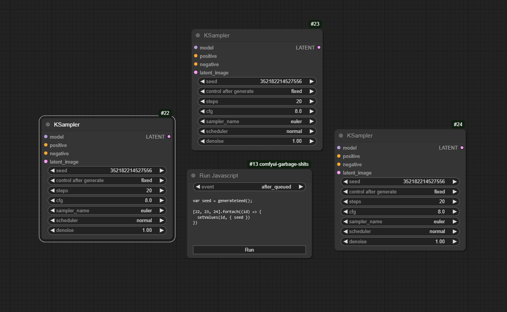

- Global prompts

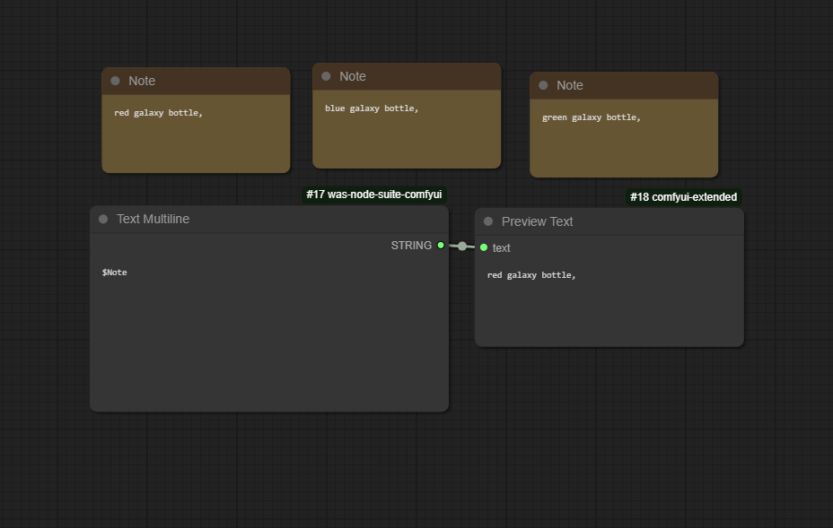

- Top level dynamic prompt

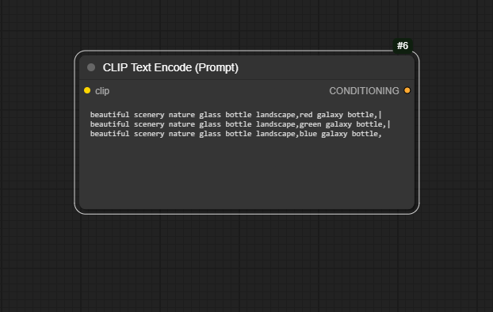

- Nested dynamic prompt

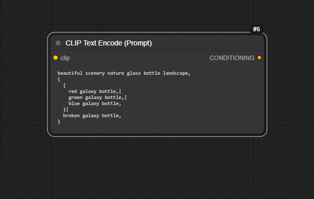

- Beautify prompt: Ctrl + B

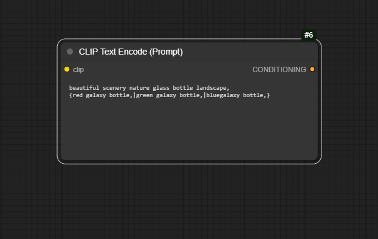

- Beautify prompt: Ctrl + Shift + B

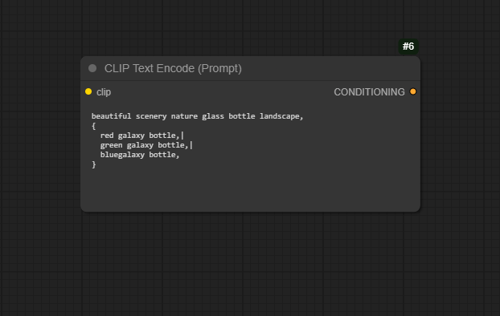

- Search target

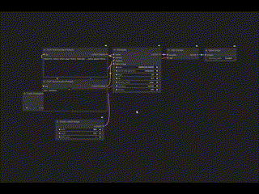

- Masking and Sketching

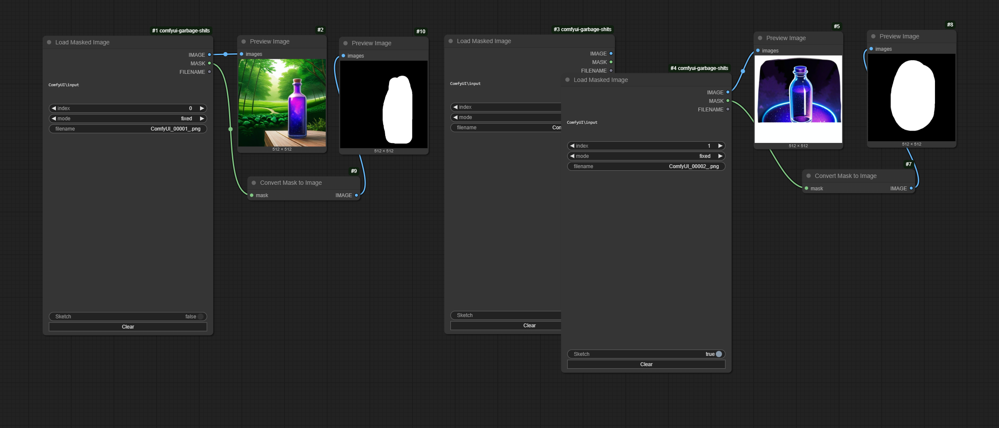

- Random lora bypass

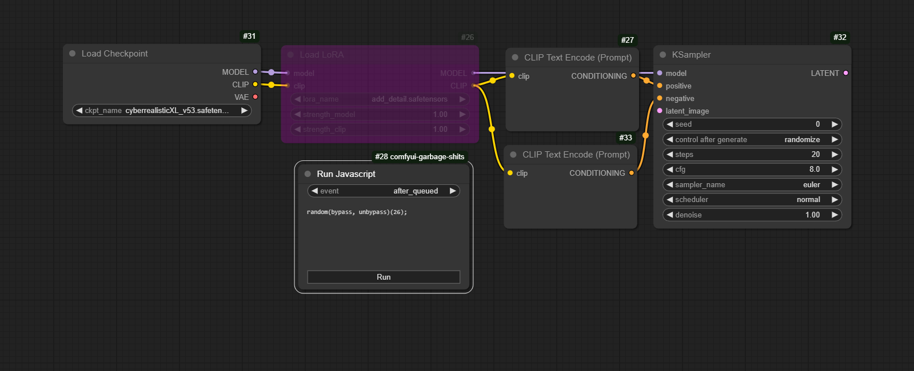

- Random connection

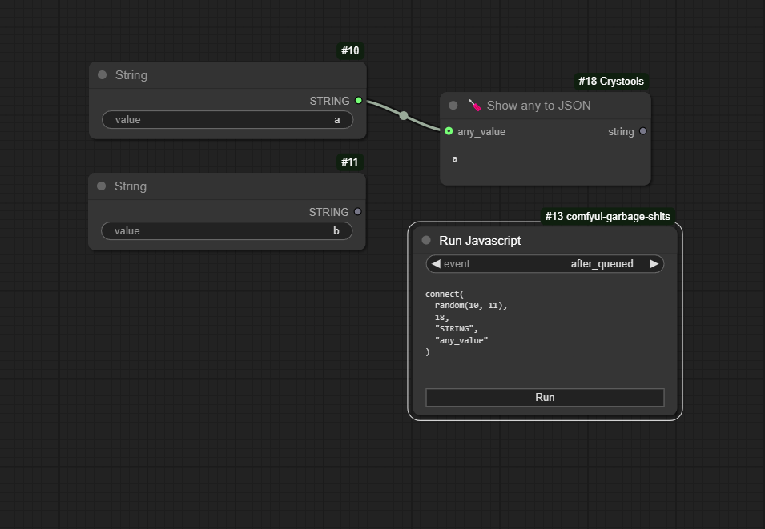

- Run random group

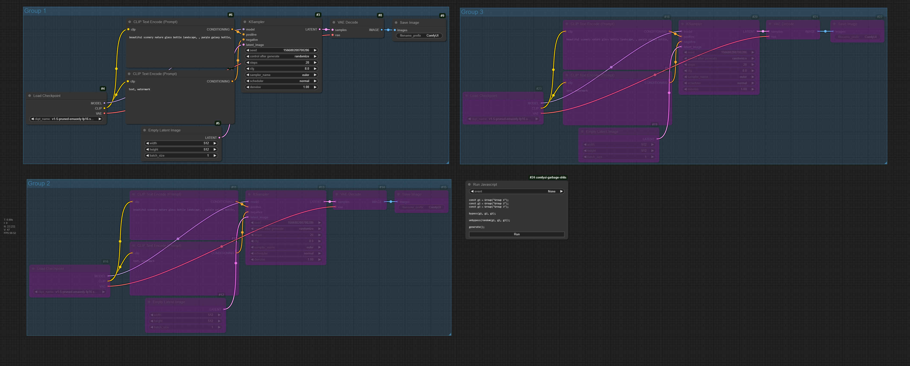

- Run a specific group

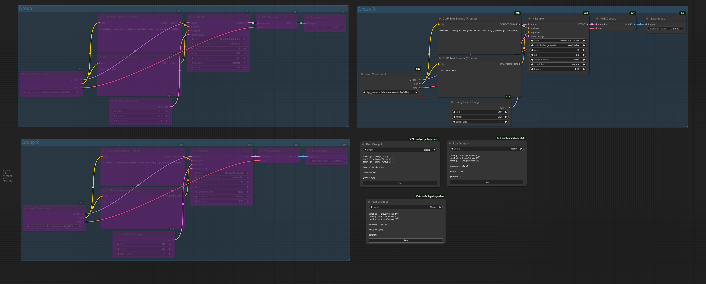

- XYZ plot

## Acknowledgements

- [ComfyUI-Custom-Scripts](https://github.com/pythongosssss/ComfyUI-Custom-Scripts)
- [ComfyUI-Inspire-Pack](https://github.com/ltdrdata/ComfyUI-Inspire-Pack)
- [was-node-suite-comfyui](https://github.com/WASasquatch/was-node-suite-comfyui)
- [wakepy](https://wakepy.readthedocs.io/)
- [JSON5](https://github.com/json5/json5)